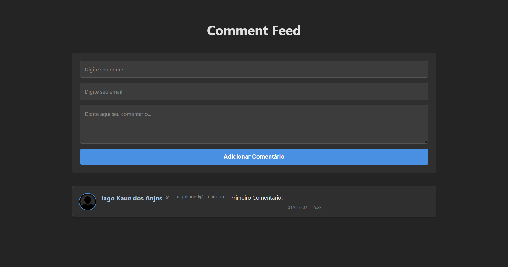

# Comment Feed 💬



## 📖 Sobre o Projeto

**Comment Feed** é uma aplicação web desenvolvida em React que simula um feed de comentários interativo. Este projeto foi criado com o objetivo de aplicar as melhores práticas do mercado de desenvolvimento de software, incluindo uma estrutura de projeto escalável, componentização, estilização moderna e um fluxo de trabalho profissional com Git e commits semânticos.

O usuário pode visualizar uma lista de comentários, adicionar novos comentários através de um formulário e remover comentários existentes.

---

## ✨ Funcionalidades

- **Listagem de Comentários:** Exibição de uma lista de comentários com avatar, nome, e-mail, data e o conteúdo do comentário.
- **Adicionar Comentário:** Formulário para adicionar um novo comentário à lista.
- **Remover Comentário:** Funcionalidade para excluir comentários da lista.
- **Layout Responsivo:** A interface se adapta a diferentes tamanhos de tela, de dispositivos móveis a monitores desktop.

---

## 🛠️ Tecnologias Utilizadas

O projeto foi construído utilizando as seguintes tecnologias:

- **[React](https://react.dev/)**: Biblioteca para construir interfaces de usuário.
- **[Vite](https://vitejs.dev/)**: Ferramenta de build moderna para desenvolvimento front-end.
- **JavaScript (ES6+)**: Linguagem de programação.
- **CSS3**: Para estilização, com uma abordagem "Mobile-First".
- **Git & GitHub**: Para versionamento de código e fluxo de trabalho.

---

## 🚀 Como Executar o Projeto

Para executar este projeto localmente, siga os passos abaixo:

```bash
# 1. Clone o repositório
git clone https://github.com/IagoKAnjos/comment-feed.git

# 2. Navegue até o diretório do projeto
cd comment-feed

# 3. Instale as dependências
npm install

# 4. Execute a aplicação em modo de desenvolvimento
npm run dev
```

Após executar os comandos, abra seu navegador e acesse `http://localhost:5173` para ver a aplicação.

---

## commits semânticos

- **feat**: (nova funcionalidade )
- **docs**: (alterações na documentação)
- **fix**: (correção de bug)
- **style**: (formatação, ponto e vírgula, etc; sem alterações de código)
- **refactor**: (refatoração de código, sem alteração de funcionalidade)
